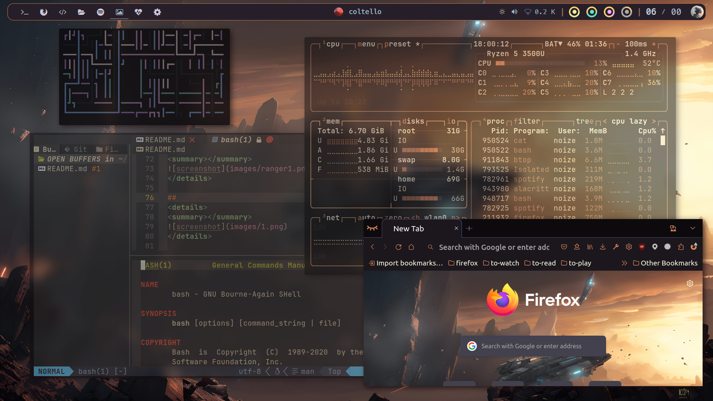
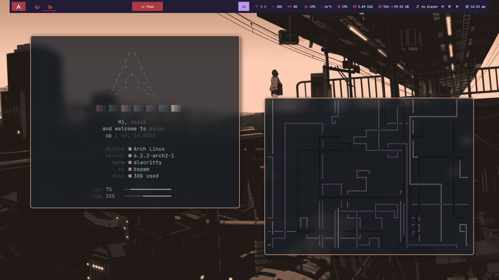

## Fully-featured global themes coming, *be patient*

<div align="center">
    <h1>【 My ⭐ dotfiles 】</h1>
    <h3></h3>
</div>

<div align="center"> 


 

</div>

https://github.com/cherrynoize/dotfiles/assets/104397138/50e9ba94-3640-4bcf-a30c-9856d7a19024





<div align="center"> 

<h3>Watch me try to make sense of my config.</h3>

</div>

## 🧱 Dependencies

```
# From the official repos:
bash
# From the AUR:
picom-ftlabs-git
```

### Needed for some functionalities (*optional*)

```
# From the official repos:
geoclue2
# From the AUR:
wpgtk pywalfox expect playerctl
```

To install all of the above (*on Arch*) run:

```
sudo pacman -S bash geoclue2
yay -S picom-ftlabs-git wpgtk pywalfox expect playerctl
```

### Not in the AUR* (or in the official repos):

#### Needed

- [theme](https://github.com/cherrynoize/theme)

#### Optional

- [set-light](https://github.com/cherrynoize/set-light)
- [n3lock](https://github.com/cherrynoize/n3lock)

> **Do submit a PR or let me know if this is outdated.*

## 🔧 Setup

I'm working on a setup script. You can clone
the repo for now and manually move things where they belong.

Something like

```
git clone https://github.com/cherrynoize/dotfiles
mv -n dotfiles/* ~
mv -n dotfiles/.* ~
```

should generally work. Please note that the `-n`
(no-clobber) flag in `mv` commands means that existing files won't
be replaced and you should manually take care of that.

You also need to run

```
./setup.sh
```

from the repo directory. This is just a stub for a full installer
which should replace this `README` section entirely.

## 🔄 Update

From now on you can just run

```
cfg pull
```

and it should automatically update your dotfiles. (Please take
care of your own unstaged changes.)

## ⚙ Configuration

### .initrc

You should copy the `.github/initrc` file somewhere and source it
during startup. It provides configuration used all over the
place. To do this you can add something like:

```
[ -f ~/.initrc ] && . ~/.initrc
```

to your `~/.xinitrc`, `~/.xprofile` or whatever does the
trick for you.

`~/.initrc` is the recommended location, as that would be the
default install path once an installation script is completed.

Right now it's just a stub, but I plan on condensing
dotfiles-wide config as much as possible into this file.

### Wpgtk

This config uses [`wpgtk`](https://github.com/deviantfero/wpgtk)
for easier global theming and automatic colorscheme generation
with `pywal`.

You're going to need to refer to the
[wiki](https://github.com/deviantfero/wpgtk/wiki)
if you want to start editing themes or creating your own.

Also, for better portability template symlinks are not hardcoded
and can be (re-)generated at anytime using `fix-wpg-templates`.

### Pfp

You might want to place your own profile picture inside of
`~/.pfp`. It can be any picture file with any name, such as
`~/.pfp/pfp.jpg`.

### Neovim

The `nvim` configuration is based upon
[AstroNvim](https://github.com/AstroNvim/AstroNvim),
an IDE layer for **Neovim**. Check out the
[docs](https://docs.astronvim.com/#%EF%B8%8F-configuration)
for info about configuration.

## 📁 Binaries

The repo also includes a large collection of shell scripts, some
[collected around the internet](../.local/bin), but [most of
them actually mine](bin). Being each few hundreds LOC tops,
they're not very large (`bin` sits at *492K* at the time of
writing - Nov. 16 2023), and since they're heavily integrated
into most of the config it made little sense leaving them out.

## $ Shell

Active development is currently only on `fish`. `bash` is
currently my login shell, so the `.bashrc` is maintained but in
a basic sense.

## 🎨 Themes

Please, refer to the
[theme](https://github.com/cherrynoize/theme) documentation for
usage.

## 🛠 Usage

>⚠ Please do not use binaries or shell aliases unless you
>understand what they do. Take the time to inspect the code first.

### ⌘ Useful commands, aliases & shortcuts

You can find all binary files in `~/bin` and `~/.local/bin`,
shell aliases in `~/.config/fish/config.fish` and keyboard
shortcuts in `.config/sxhkd/sxhkdrc`. Compiling an extensive
shortcuts/commands help is in the [`TODO`](#-todo) list.

<details>
<summary>This is just some basic commands to get you
started.</summary>

#### Spawn a terminal window

    "$TERMINAL" # Super+shift

#### Application launcher

    rofi -show drun # Super+x

#### Run prompt

    rofi -show run # Super+r

#### Theme selector

    theme-picker # Super+space

#### Switch between selected theme's wallpapers

    wall-picker # Super+ctrl+space

#### Random wallpaper

    change-wallpaper # Super+Ctrl+w

#### Dark mode on/off

    switch-mode # Super+<

#### Toggle dock

    dock toggle # Super+z

#### Launch browser

    "$BROWSER" # Super+Alt+w

#### Text editor

    launch-nvim # use 'nvim' as an alias fish/bash

#### Fix common issues

    unfuck everything # Super+Shift+Esc

### ⌨ Keys

#### Neovim

    {Alt,Shift}+Tab            Move to next/previous tab
    Space;{Shift}+Tab          Move to next/previous buffer
    Alt+{h,j,k,l}              Move to adjacent window
    Ctrl+{h,j,k,l}             Move to adjacent window (wraparound)
    Ctrl+{Left,Up,Down,Right}  Resize window
    Space                      Help menu

#### Rofi

    {Tab,Shift}+Tab  Move to next/previous entry
    h,j,k,l          Vi-like keybindings for moving around
    Alt+{h,j,k,l}    Where there's also a searchbar

</details>

### 📔 Tricks & tips

#### Auto-refresh sudo timeout

`sudo` privilege timeout for the shell is refreshed with `sudo
-v`. `fish` already has [an abbreviation set](../.config/fish/fishrc)
to replace `sudo` with `sudo -v; sudo` so that it gets updated
each time. However, I find that cumbersome as well as annoying
to have that prefix to each command and it doesn't work well
with auto-completion/suggestions as well as with other
abbreviations, so you can call `sd` rather than `sudo`
to avoid all that. (Also, in case you're wondering, you cannot
use a function because that would enter an infinite loop.)

In case it conflicts with other programs in your system, just use
`sudo`.

### 🐛 Known bugs

#### Firefox

Some issues with text visibility in light mode.

#### eww

- Widget windows closers sometimes get stuck open, causing you to
accidentally open popup windows when clicking on other windows
rather than close them. To fix this you could restart `eww`,
but usually it's enough to click on the pfp icon that open the
panel window once to open it, then a second time to close it.

- `eww` tends to get on top of other windows after being
restarted during the session. I still haven't found how I could
prevent it from happening (all suggestions are welcome).

> My workaround for the time being is to just
> [toggle the bar](#-toggle-bar). Besides, if you don't ever
> toggle it this shouldn't come up.

#### Music player cover

I currently use Spotify and as such I only set [`music`](../bin/music)
to fetch cover arts from Spotify metadata. I will try to expand
on this but, please, if anyone has a specific request provide me
with a metadata sample (output of `playerctl --player="$player"
metadata mpris:artUrl`) and I'll add it.

### 🔩 Troubleshooting

In case something's not working as expected:

```
unfuck everything
```

This *might* help. If it doesn't, you'll have to identify the
issue and actually do something about it. (You can have a look at
the [known bugs](#-known-bugs).) If you find something that
doesn't fit, please
[open an issue](https://github.com/cherrynoize/dotfiles/issues).

## 📋 TODO

### Install and configuration

- Installation script
- Finish making initrc

### Bar

- Auto memorize bar status (open or closed) between sessions
- Fix bar auto closing on resume after sleep

### Wallpapers

- Implement wallpaper history for each theme and start sorting
by most recent in `wall-picker`
- Convert to a higher compression format
- AI upscaler on-the-fly with cache storage support
- Some wallpapers have some ugly artifacts/watermarks to be
removed
- Cut out border from wallpapers in
[`meranii`](../.wallpaper-themes/meranii) theme

### Themes

- Make `switch-mode` keep both `-dark` and `-light` versions
and use a suffix-less link to avoid this dizzy switching back
and forth in commits just because a different mode is set.
(Be sure to have it check for link destination instead of
existance in `get_cur_mode`.)

### Support

- Shortcuts/commands usage popup window

## ✨ Contribute

You can have a look at the [TODO](#-todo) and
[known bugs](#-known-bugs) lists. Or open a PR/issue if you have
found more.

If you feel like you have something to add please do.

### Community themes

If you feel like it, you can submit your own theme. I'm not
exactly sure what I'm going to do with those but I would like
people to be able to share and browse custom themes.
Or I might add them to the main repo if they fit.

Even the wallpapers alone are worth consideration if it's a well
curated selection of at least 2 or 3 for both light and
dark versions.

## 💕 Sponsor

[**Buy me a coke 💙**](https://cherrynoize.github.io/#/contribute)

## 🙏 Thanks

- [gh0stzk's dotfiles](https://github.com/gh0stzk/dotfiles) for
inspiration as well as a lot of code stolen especially for the
Rofi theme selector
- [wacca〇わっか](https://www.pixiv.net/en/users/46612726) for
her amazing collection
([meranii theme](../.wallpaper-themes/meranii))
- Also I've removed some watermarks from a few wallpapers just
for aesthetic reasons, please don't get mad at me. I'll be glad
to add a link to your original work if you reach out.

## And thanks to you for using my dotfiles

*Bye!*
