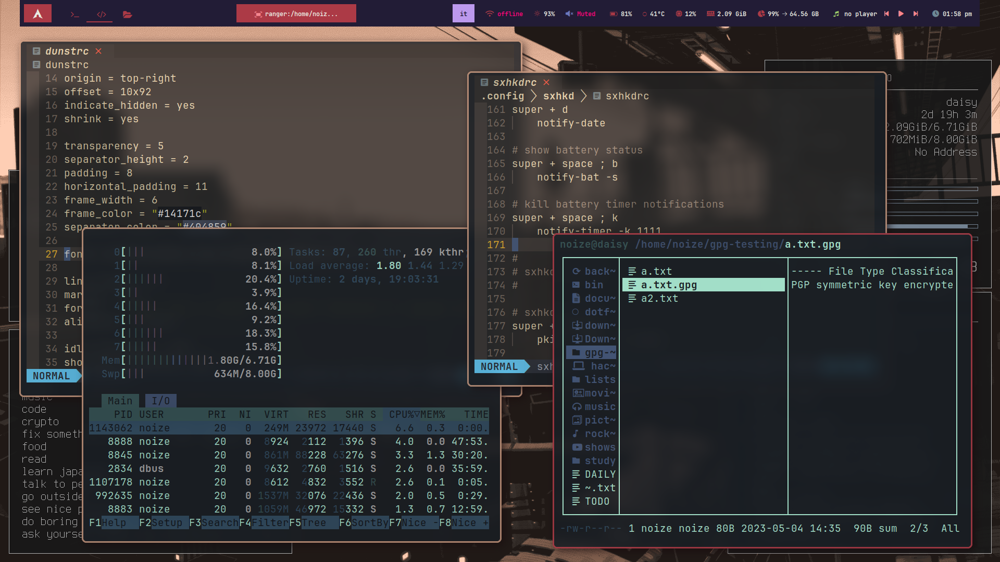
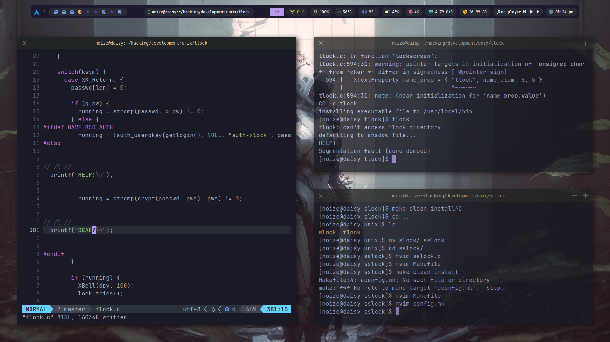
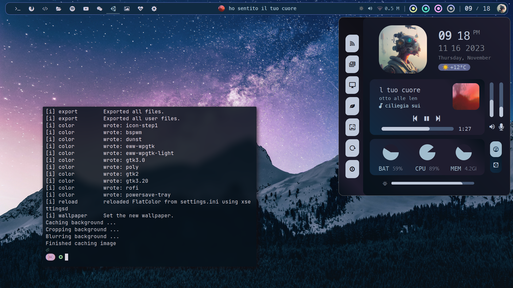
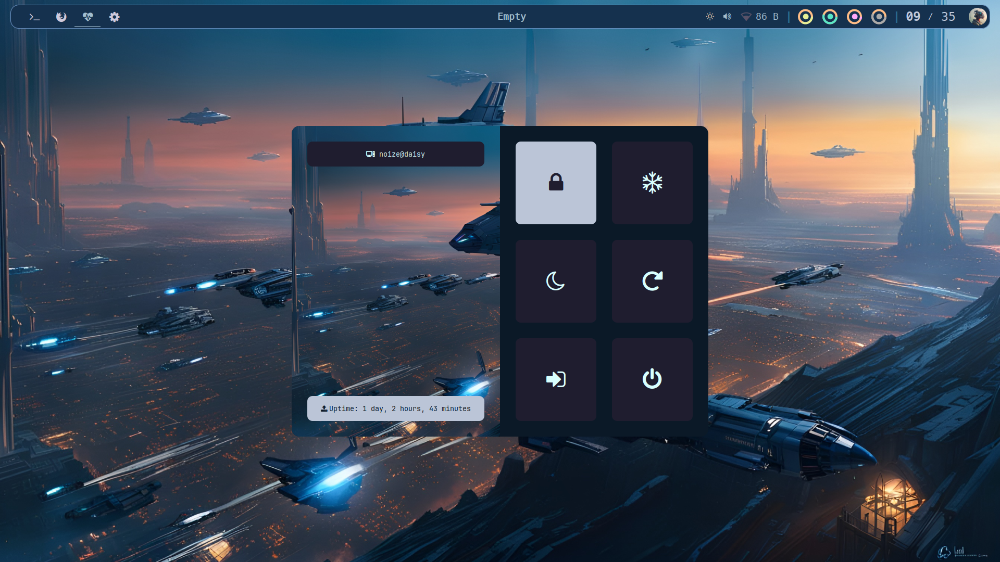
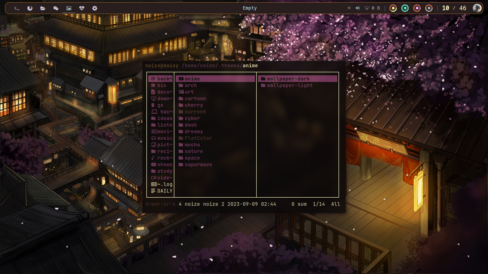
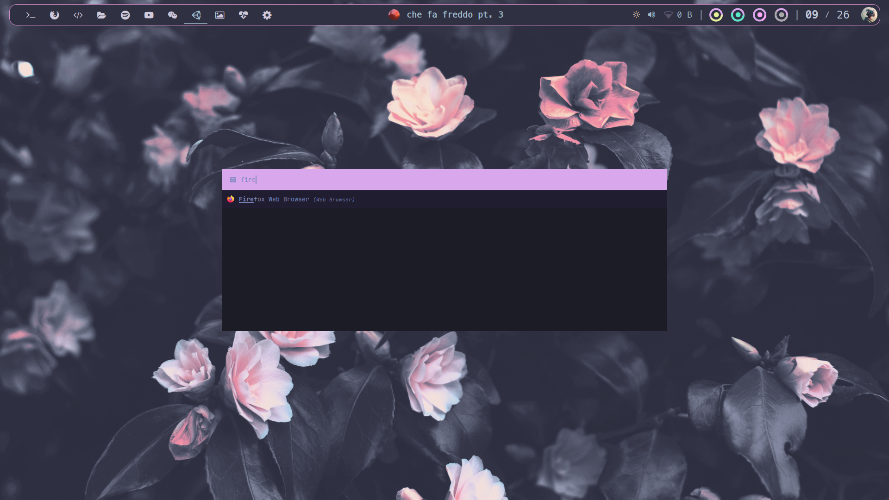
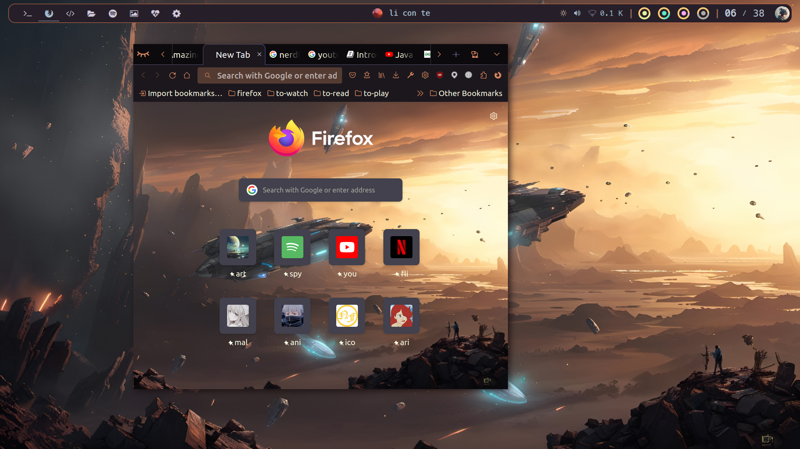

# Dotfiles

[](https://youtu.be/ph19WxzsCRg)


These are my current dotfiles. I update them as I go and try to
produce *stable* forks to preserve major changes and pivotal
moments along the way, sometimes for separate programs too.

That is why you will see a list of submodules which are actually
just parts of these dotfiles, but also standalone repos.

## Install

Though I'm planning to provide a setup script, you can just clone
the repo for now and then manually move things where they belong.

Something like

```
git clone https://github.com/cherrynoize/dotfiles
mv -n dotfiles/* ~
mv -n dotfiles/.* ~
```

should generally work. Please note that I've added the `-n`
no-clobber flag in `mv` commands, meaning existing files won't
be replaced and you should manually take care of that.

## Update

From now on you can just run

```
cfg pull
```

and it should automatically update your dotfiles. (Please take
care of your own unstaged changes.)

## Configuration

### .initrc

You should copy the `.github/initrc` file somewhere and source it
during startup. It provides configuration used all over the
place. To do this you can add something like:

```
[ -f "~/.initrc" ] && . "~/.initrc"
```

to your `~/.xinitrc`, `~/.profile` file or whatever does the
magic for you.

`~/.initrc` is the recommended location, as that would be the
default install path once an installation script is completed.

Right now it's just a stub, but I plan on condensing
dotfiles-wide config as much as possible into this file.

### Pfp

You might want to place your own profile picture inside of
`~/.pfp`. It can be any picture file with any name, such as
`~/.pfp/pfp.jpg`.

## Binaries

The repo also includes a large collection of shell scripts, some
[collected around the internet](.local/bin), but [most of
them](bin) are actually mine. Being each few hundreds LOC tops,
they're not very large (`bin` sits at *492K* at the time of
writing - Nov. 16 2023), and since they're heavily integrated
into my everyday system usage and used in most of my
configuration it made little sense leaving them out (or
separating them).

## Shell

Active development is currently only on `fish`. Config for other
shells such as `bash` or `zsh` is currently unmantained. They have
had previous support though and I occasionally work on `bash`
(whereas `zsh` is just some stolen configs), so the config files
are still there. (Not to mention `bash` is actually my current
login shell, `fish` gets launched from there.)

## Themes

Themes are currently in alpha so please be nice. I'm setting up
themes for all sorts of things though - it just takes some time.

To change themes:

```
switch-theme [thing-to-change-theme-for] [new-theme]
```

List items that have themes:

```
switch-theme -l
```

And finally list available themes for given item:

```
switch-theme [item] -l
```

A `rofi` GUI for global theme switching is a *TODO* thing. But
first `switch-theme` needs some more cleaning, in case you want to
contribute.

## Screenshots

### Themes

#### wpgtk

<details>
<summary></summary>


</details>

#### Dash

<details>
<summary></summary>




</details>

#### awesome (deprecated)

<details>
<summary></summary>



</details>

### Modules

#### eww

<details>
<summary></summary>



</details>

#### Polybar

<details>
<summary></summary>


</details>

#### Powermenu

<details>
<summary></summary>



</details>

#### Screenlock

<details>
<summary></summary>


</details>

#### ranger

<details>
<summary></summary>



</details>

#### rofi

<details>
<summary></summary>



</details>

#### Firefox

<details>
<summary></summary>



</details>

## Dependencies

```
bash
```

Optional (some are still needed for certain functionalities):

```
wpgtk pywalfox expect playerctl
```

Not in the AUR* (optional):

- [set-light](https://github.com/cherrynoize/set-light)
- [n3lock](https://github.com/cherrynoize/n3lock)

*\*Do submit a PR or else let me know if this is wrong.*

## Usage

### Commands/aliases & shortcuts

You can find the whole configuration under
`.config/sxhkd/sxhkdrc`, but this is just some basic commands to
get you started. Also to remember commands which are not bound
to any key (such as the text-editor launcher).

#### Spawn terminal

    "$TERMINAL" # Super+shift

#### Application launcher

    rofi -show drun # Super+x

#### Run prompt

    rofi -show run # Super+r

#### Browser (Firefox)

    ff # Super+Alt+w

#### Text editor (Neovim)

    launch-nvim # 'nvim' points to that in fish/bash

#### Random wallpaper

    change-wallpaper # Super+Ctrl+w

#### Fix common issues

    unfuck everything # Super+Shift+Esc

### Tricks & tips

#### Auto-refresh sudo timeout

`sudo` privilege timeout for the shell is refreshed with `sudo
-v`. `fish` already has [an abbreviation set](.config/fish/fishrc)
to replace `sudo` with `sudo -v; sudo` so that it gets updated
each time. However, I find that cumbersome as well as annoying
to have that prefix to each command and it doesn't work well
with auto-completion/suggestions as well as with other
abbreviations, so you can call `sd` rather than `sudo`
to avoid all that. (Also, in case you're wondering, you cannot
use a function because that would enter an infinite loop.)

In case it conflicts with other programs in your system, just use
`sudo`.

## TODO

### Wallpapers

- Convert to a higher compression format

### Scripts

- Installation script
- Finish making initrc
