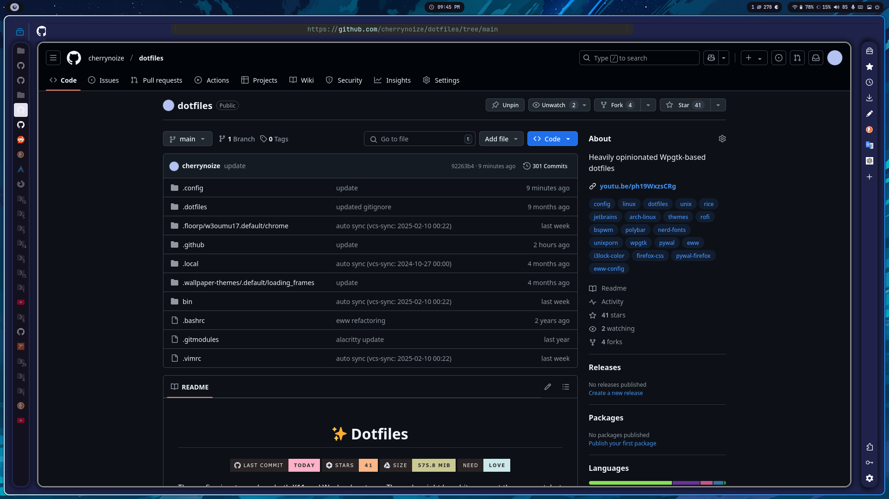
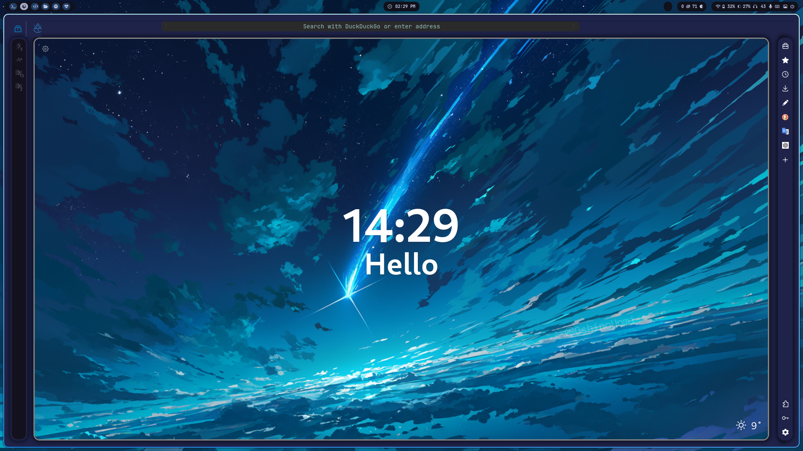
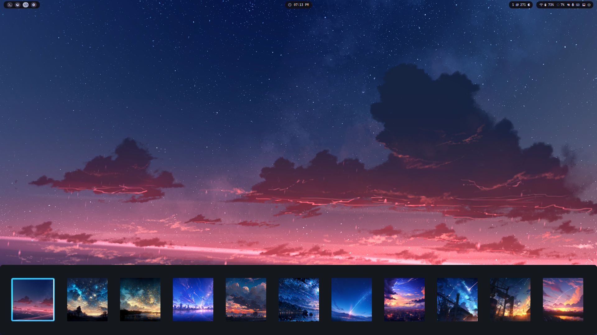
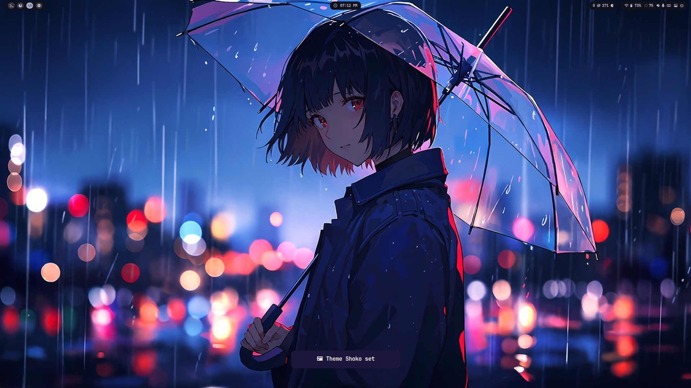
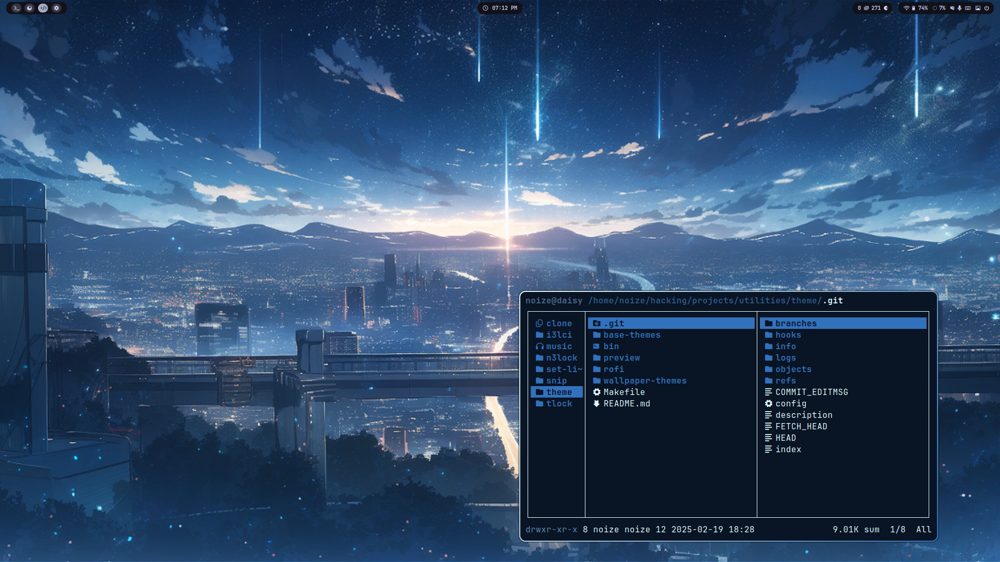
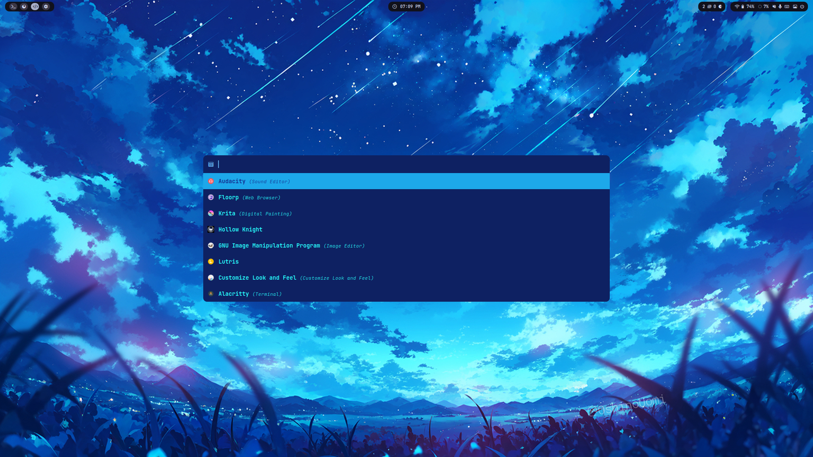
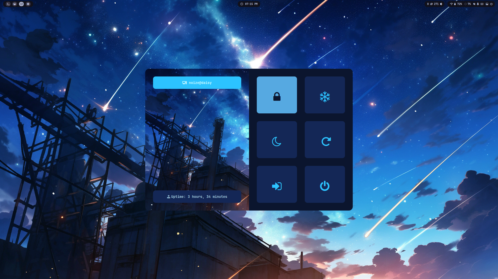
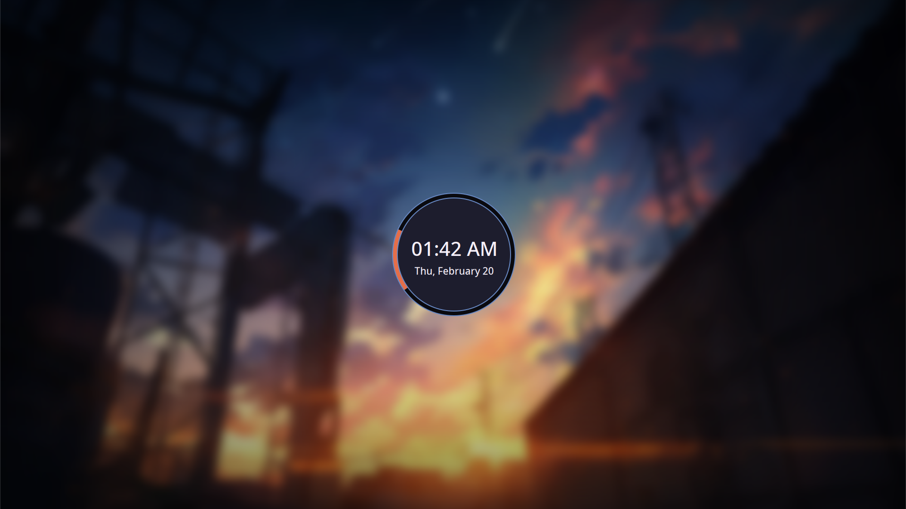

<div align="center">
    <h1>✨ Dotfiles</h1>
    <h3></h3>
</div>

<div align="center"> 


 

</div>

<div align="center"> 

</div>

Though I write most scripts to work on both X11 and Wayland, I mostly run
Hyprland now. So I guess you could call these **Hyprland dotfiles** for the
time being. A lot of the config is still independent of your window/display
manager though.

## 📸 Preview

[](https://youtu.be/7TCS0B8XFfQ)

### 🎨 Themes

| Ai |
|:-:|
||

| Akane |
|:-:|
||

| Ishida |
|:-:|
||

| Mayuri |
|:-:|
||

| Meranii |
|:-:|
||

| Misato |
|:-:|
||

| Nina |
|:-:|
||

| Sakura |
|:-:|
||

| Shina |
|:-:|
||

| Shinji |
|:-:|
||

| Shoko |
|:-:|
||

| Sosuke |
|:-:|
||

### 🌞 Light mode

<details>
<summary>All themes ship with a (more or less developed) light mode too <i>(click for preview)</i></summary>

| Sosuke (light) |
|:-:|
||

</details>

> Screenshots may not always be up-to-date. You can check themes out by running
> `theme-picker`.

### 🚀 Apps/widgets

> Note: these are only some specific themes for these `contexts` (refer to
> [theme](https://github.com/cherrynoize/theme#context-themes)).

|  |  |
| :-: | :-: |
| Floorp | Floorp (new tab) |

| Wall picker | Theme picker |
|:-:|:-:|
|  |  |

||||
|:-:|:-:|:-:|
| Dunst | Ranger | Rofi |

| Logout menu | Screenlock |
|:-:|:-:|
|||

## 🧱 Dependencies

```
# Official repos (Arch):
bash
# AUR:
picom-ftlabs-git
```

### For added functionalities (*optional*)

```
# Official repos (Arch):
geoclue2
# AUR:
expect playerctl
```

To install all of the above (*on Arch*) run:

```
sudo pacman -S bash geoclue2
yay -S picom-ftlabs-git expect playerctl
```

### Not found in AUR (*[correct me if I'm wrong](https://github.com/cherrynoize/dotfiles/pulls)*)

#### Required

- [theme](https://github.com/cherrynoize/theme)

#### Optional

- [n3lock](https://github.com/cherrynoize/n3lock)
- [set-light](https://github.com/cherrynoize/set-light)

## 🔧 Setup

I'm working on a setup script, but it's still a stub.

```
git clone https://github.com/cherrynoize/dotfiles
cd dotfiles
./.github/install.sh

# need to move some stuff around manually:

mv -n * ~
mv -n .* ~
```

> Note the `-n` (no-clobber) flag, meaning existing files won't
> be replaced and you should manually take care of that.

## 🔄 Update

From now on you can just run:

```
cfg pull
```

and it should automatically update your dotfiles. (Please, take
care of your own unstaged changes.)

## ⚙ Configuration

### .initrc

You need to source `~/.initrc` during startup. It provides
configuration used all over the place. To do this you can add
something like:

```
[ -f ~/.initrc ] && . ~/.initrc
```

to your `~/.xinitrc`, `~/.xprofile`. You can just execute it
from your WM if you're on Wayland.

### Environment variables

To set environmental variables used throughout the dotfiles,
add to your `~/.profile`:

```
[ -f ~/.env ] && . ~/.env
```

And make sure your display manager sources `~/.profile` for
Wayland sessions. You can add the line above in any other file
sourced at login.

### Wpgtk

This config uses [theme](https://github.com/cherrynoize/theme)
which in turn uses [wpgtk](https://github.com/deviantfero/wpgtk)
for easier global theming and automatic colorscheme generation
with `pywal`.

For better portability template symlinks are not hardcoded
and can be regenerated anytime using `fix-wal-templates` and
`fix-wpg-templates`.

>**Warning**: this will delete all (and only) symlinks in the `wal`
>and `wpg` template directories respectively, and generate only
>those specified in the `fix-*-templates` scripts.
>(This is automatically run in the installation script.)

You can also add your own templates as you regularly would
(please refer to the
[Wpgtk wiki](https://github.com/deviantfero/wpgtk/wiki)).

### Pfp

You might want to place your own profile picture inside of
`~/.pfp`. This can be used by applications, widgets, panels, ...

It can be any picture file with any name, such as `~/.pfp/pfp.jpg`.

### Neovim

The `nvim` configuration is based upon
[AstroNvim](https://github.com/AstroNvim/AstroNvim),
an IDE layer for **Neovim**. Check out the
[docs](https://docs.astronvim.com/#%EF%B8%8F-configuration)
for info about configuration.

## 📁 Binaries

The repo also includes a large collection of shell scripts, some
[collected around the internet](../.local/bin), but [most of
them are actually my own](bin).

## $ Shell

Active focus is currently on `fish`. In my setup, `bash` is
used as the login shell, which spawns `fish` when run interactively.
So `bash` config is maintained only in a basic way.

## 🎨 Themes

Please, refer to the
[theme](https://github.com/cherrynoize/theme) documentation for
usage.

## 🛠 Usage

> ⚠ Please do not run binaries or use shell aliases unless you
> understand what they do. Take the time to inspect the source first.

You can find all binary files in `~/bin` and `~/.local/bin`,
shell aliases in `~/.config/fish/config.fish` and keyboard
shortcuts in `~/.config/hypr/keybindings.conf` (or in the unmantained `sxhkd`
config: `~/.config/sxhkd/sxhkdrc`).
[`TODO`](#-todo) list.

### ⌘ Keybindings

For a complete list of all keybindings hit `Super+F1` or execute `cheatsheet`.

<details>
<summary>This is just some basic keybindings to get you
started.</summary>

#### Spawn a terminal window

    "$TERMINAL" # Mod+Return

#### Application launcher

    rofi -show drun # Mod+x

#### Run prompt

    rofi -show run # Mod+r

#### Powermenu

    powermenu # Mod+q

#### Theme selector

    theme-picker # Mod+Esc (slow to startup, duly noted)

#### Wallpaper picker

    wall-picker # Mod+Shift+Esc

#### Random wallpaper

    change-wallpaper # Mod+Ctrl+w

#### Dark mode on/off

    switch-mode # Mod+<

> Please note: **may not always be up to date**, refer to full cheatsheet if
> having issues.

###  Useful commands

#### Text editor

    launch-nvim # 'nvim' is an alias for that in fish/bash

### ⌨ Application shortcuts

#### Neovim

    {Alt,Shift}+Tab            Move to next/previous tab
    Space;{Shift}+Tab          Move to next/previous buffer
    Alt+{h,j,k,l}              Move to adjacent window
    Ctrl+{h,j,k,l}             Move to adjacent window (wraparound)
    Ctrl+{Left,Up,Down,Right}  Resize window
    Space                      Help menu

#### Rofi

    {Tab,Shift}+Tab  Move to next/previous entry
    h,j,k,l          Vi-like keybindings for moving around (with no inputbar)
    Alt+{h,j,k,l}    Where there's also an inputbar

</details>

### 📔 Tricks & tips

#### Auto-refresh sudo timeout

`sudo` privilege timeout for the shell is refreshed with `sudo
-v`. `fish` already has [an abbreviation set](../.config/fish/fishrc)
to replace `sudo` with `sudo -v; sudo` so that it gets updated
each time. However, I find that cumbersome as well as annoying
to have that prefix to each command and it doesn't work well
with auto-completion/suggestions as well as with other
abbreviations, so you can call `sd` rather than `sudo`
to avoid all that (you cannot
use a function because that would enter an infinite loop.)

Or just use `sudo`.

### 🐛 Known bugs

#### Firefox

- Some text visibility issues in light mode (inherited from
[theme](https://github.com/cherrynoize/theme)).

#### Waybar

- Random wallpaper button not working.

#### eww (deprecated)

- Widget windows closers sometimes get stuck open, causing you to
accidentally open popup windows when clicking on other windows
rather than close them. To fix this you could restart `eww`,
but usually it's enough to click on the pfp icon that open the
panel window once to open it, then a second time to close it.

- On **bspwm** `eww` tends to get on top of other windows after being
restarted during the session. I still haven't found how I could
prevent it from happening (all suggestions are welcome).

> The `eww` config is currently unmantained.

### 🔩 Troubleshooting

In case something's not working as expected you can run from the terminal:

```
unfuck everything # Mod+Alt+Shift+Backspace
```

This *might* help. If it doesn't, you'll have to identify the
issue and actually do something about it. (You can have a look at
the [known bugs](#-known-bugs).) If you find something that
doesn't fit, please
[open an issue](https://github.com/cherrynoize/dotfiles/issues).

## 📋 TODO

### Install and configuration

- Installation script
- Finish initrc

## ✨ Contribute

You can have a look at the [TODO](#-todo) and
[known bugs](#-known-bugs) lists. Or open a PR/issue if you have
found more.

If you feel like you have something to add please do.

## 💕 Sponsor

[**Buy me a coke 💙**](https://cherrynoize.github.io/#/contribute)
